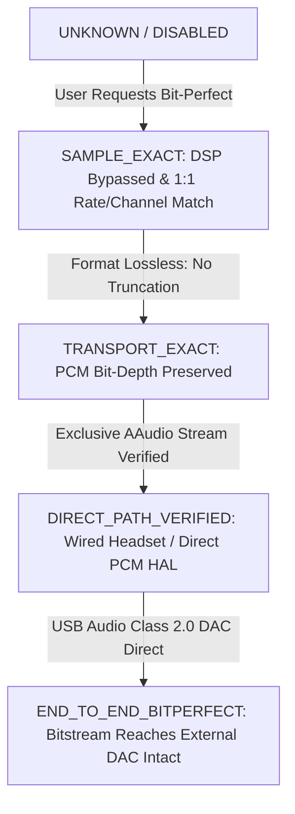

# Bit-Perfect Truth Model & Multi-Tier Verification Architecture

## 1. Absolute Forensic Philosophy

In consumer Android audio engines, "Bit-Perfect" is frequently abused as marketing terminology. Players often declare "Bit-Perfect" simply because:
- An AAudio stream was requested in `EXCLUSIVE` mode (even if granted `SHARED`).
- Track metadata sample rate matches output sample rate (even if AudioFlinger resampled internally).
- DSP is toggled off (even if system audio effects or volume attenuation are active).
- A 32-bit float audio sink is open (even when precision truncation occurs from 32-bit integer PCM).

**Antigravity Player strictly rejects all heuristic or inferred bit-perfect claims.**

Android's Audio HAL, AudioFlinger, and USB audio drivers have physical verification boundaries. Unless an end-to-end evidence chain can be physically proven against live telemetry, the verifier **fails closed**.

---

## 2. The 5 Operational Bit-Perfect Tiers

Rather than a binary True/False, the engine classifies playback state into 5 rigorously defined tiers:

### Tier Definitions

1. **`UNKNOWN` / `DISABLED`**:
   - Bit-Perfect mode is either switched off by the user, or stream telemetry is unavailable.
2. **`SAMPLE_EXACT`**:
   - Source sample rate and output sample rate match 1:1 ($44.1\text{k} \rightarrow 44.1\text{k}$, $96\text{k} \rightarrow 96\text{k}$, $192\text{k} \rightarrow 192\text{k}$).
   - Channel counts match 1:1 (Stereo $\rightarrow$ Stereo).
   - All internal DSP stages (EQ, PEQ, ReplayGain, Tone, Limiter, Saturation, HRTF) are completely bypassed.
3. **`TRANSPORT_EXACT`**:
   - All `SAMPLE_EXACT` conditions met.
   - Bit depth is losslessly preserved without truncation (e.g. 16-bit or 24-bit PCM).
   - Verified that IEEE 754 32-bit Float AudioSink does not truncate precision (24-bit significand limits).
4. **`DIRECT_PATH_VERIFIED`**:
   - All `TRANSPORT_EXACT` conditions met.
   - Native Oboe stream is verified running in `EXCLUSIVE` sharing mode on AAudio.
   - Route is verified as Wired Headphones / 3.5mm Direct DAC.
   - AudioFlinger mixer thread is proven inactive.
5. **`END_TO_END_BITPERFECT`**:
   - All `DIRECT_PATH_VERIFIED` conditions met.
   - Output device is an external USB Audio Class 2.0 DAC operating in exclusive asynchronous packet mode.
   - Zero mixer intervention, zero software volume scaling, zero resampling between file decode and DAC conversion silicon.

---

## 3. Coherent Single-Snapshot Verification Protocol

Every verification pass in `BitPerfectVerifier.verify()` evaluates against a **single immutable** `CanonicalAudioRuntimeSnapshot`. States from different moments in time are never combined.

### Fail-Closed Decision Matrix (35 Mandatory Rules)

| Rule # | Criterion Evaluated | Verification Condition | Fail-Closed Action |
| :--- | :--- | :--- | :--- |
| **1** | Native stream handle | Non-zero active stream handle | Rejects (`UNAVAILABLE`) |
| **2** | Stream lifecycle active | `nativeStream.isStarted == true` & matching generation | Rejects (`REQUESTED` / `UNAVAILABLE`) |
| **3** | Active route verified | `confidence == Confidence.VERIFIED` | Rejects (`ACTIVE_UNVERIFIED`) |
| **4** | Route device eligibility | Rejects Bluetooth A2DP, Speaker, Earpiece | Rejects (`UNAVAILABLE`) |
| **5** | Audio API known | `audioApi.confidence == Confidence.VERIFIED` | Rejects (`ACTIVE_UNVERIFIED`) |
| **6** | Sharing mode known | `sharingMode.confidence == Confidence.VERIFIED` | Rejects (`ACTIVE_UNVERIFIED`) |
| **7** | Exclusive sharing mode | Must be strictly `EXCLUSIVE` (no shared mixer) | Rejects (`UNAVAILABLE`) |
| **8** | Output sample rate verified | `actualOutput.sampleRate.confidence == VERIFIED` | Rejects (`ACTIVE_UNVERIFIED`) |
| **9** | Source sample rate verified | `source.sampleRate.confidence == VERIFIED` | Rejects (`ACTIVE_UNVERIFIED`) |
| **10** | 1:1 Sample rate clock match | Output sample rate == Source sample rate | Rejects (`UNAVAILABLE`) |
| **11** | Output channel count verified | `actualOutput.channels.confidence == VERIFIED` | Rejects (`ACTIVE_UNVERIFIED`) |
| **12** | Source channel count verified | `source.channels.confidence == VERIFIED` | Rejects (`ACTIVE_UNVERIFIED`) |
| **13** | Channel count match | Output channels == Source channels | Rejects (`UNAVAILABLE`) |
| **14** | Output encoding verified | `actualOutput.encoding.confidence == VERIFIED` | Rejects (`ACTIVE_UNVERIFIED`) |
| **15** | Encoding compatibility | Non-lossy linear PCM only | Rejects (`UNAVAILABLE`) |
| **16** | Resampler inactive | Must be `OFF` or `BYPASS` | Rejects (`UNAVAILABLE`) |
| **17** | Master DSP bypassed | `dsp.isBitPerfectBypass == true` or `!isEnabled` | Rejects (`UNAVAILABLE`) |
| **18** | Graphic EQ disabled | `!dsp.isEqActive` | Rejects (`UNAVAILABLE`) |
| **19** | Tone controls disabled | Bass, Treble, Clarity, Air presence inactive | Rejects (`UNAVAILABLE`) |
| **20** | PEQ / AutoEQ disabled | No active parametric equalization | Rejects (`UNAVAILABLE`) |
| **21** | True-peak limiter disabled | Limiter inactive | Rejects (`UNAVAILABLE`) |
| **22** | TPDF dither disabled | Dither inactive | Rejects (`UNAVAILABLE`) |
| **23** | Digital volume unity | `dvcVolume == 1.0` ($\pm 0.001$) | Rejects (`UNAVAILABLE`) |
| **24** | Preamp gain unity | `preAmpGainDb == 0.0` ($\pm 0.01\text{ dB}$) | Rejects (`UNAVAILABLE`) |
| **25** | ReplayGain unity | `replayGainMultiplier == 1.0` or `!replayGainEnabled` | Rejects (`UNAVAILABLE`) |
| **26** | Saturation / Warmth off | Triode, Pentode, Warm saturation inactive | Rejects (`UNAVAILABLE`) |
| **27** | HRTF 3D spatial off | Spatial audio toggle disabled | Rejects (`UNAVAILABLE`) |
| **28** | Crossfeed off | Crossfeed inactive | Rejects (`UNAVAILABLE`) |
| **29** | Channel balance unity | `channelBalance == 0.0` ($\pm 0.01$) | Rejects (`UNAVAILABLE`) |
| **30** | No channel transform | Stereo expansion, phase invert, mono sub-bass off | Rejects (`UNAVAILABLE`) |
| **31** | No lossy PCM truncation | Rejects 32-bit int PCM to 32-bit float sink | Rejects (`UNAVAILABLE`) |
| **32** | Direct HAL path active | Verified direct path without AudioFlinger | Rejects (`ACTIVE_UNVERIFIED`) |
| **33** | Audio mixer inactive | `mixerPathActive == false` | Rejects (`UNAVAILABLE`) |
| **34** | Telemetry completeness | All critical fields must have `Confidence.VERIFIED` | Rejects (`ACTIVE_UNVERIFIED`) |
| **35** | Telemetry freshness | Telemetry captured within past 10 seconds | Rejects (`UNAVAILABLE`) |

---

## 4. Negative Dominance & Zero False Positives

If **even one** of the 35 rules fails or has non-verified confidence:
- The status is **IMMEDIATELY REJECTED** from `VERIFIED`.
- It falls back to `ACTIVE_UNVERIFIED` (if only external hardware confirmation is missing) or `UNAVAILABLE` (if any signal modification or mismatch is detected).
- Under NO circumstance does Antigravity Player infer or assume hardware bit-perfection.
