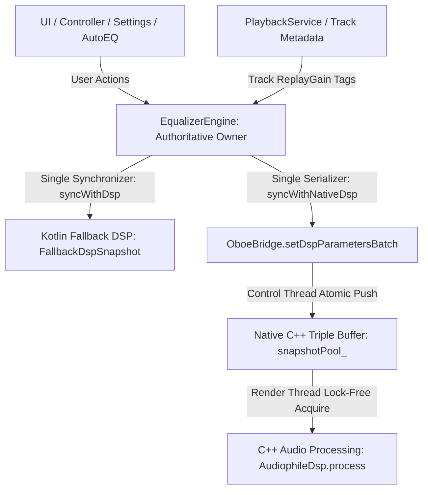

# Authoritative DSP State Ownership Architecture

## 1. Executive Summary & Defect Remediation

Prior to this forensic remediation, DSP state in **Antigravity Player** suffered from architectural fragmentation across multiple competing layers:
1. `EqualizerEngine` maintained its own StateFlows for band gains, preamp, crossfeed, tone, and spatial audio.
2. `OboeAudioSink` maintained a parallel serialization implementation (`syncDspParameters`) that read disparate values directly from `dspProcessor` fields, resulting in divergent parameter mappings (e.g. bass boost scaled differently, ReplayGain flags checked inconsistently).
3. `PlaybackService` pushed ReplayGain values directly into `dspProcessor.replayGainMultiplier` without verifying whether ReplayGain was enabled in user settings, and called native synchronization independently.
4. When ReplayGain was disabled, the C++ DSP ternary `(p.replayGainMultiplier > 0.0 ? p.replayGainMultiplier : 1.0)` erroneously kept applying the stale multiplier.

### Remediated Single Canonical Pipeline



---

## 2. The Single Authoritative State Owner: `EqualizerEngine`

`EqualizerEngine` is formally designated as the **Sole Authoritative Owner** of all DSP parameters, including:
- **10-Band Graphic EQ**: ISO center frequencies (31 Hz to 16 kHz) scaled in millibels.
- **Parametric EQ (PEQ)**: Custom biquad cascades managed via `AutoEqEngine`.
- **Preamp Gain**: Direct decibel gain ($\pm 15.0\text{ dB}$).
- **ReplayGain**: Track/Album gain multiplier, peak clamping, and explicit `replayGainEnabled` master gate.
- **Tone Controls**: Dynamic Bass Boost ($0-15\text{ dB}$), Treble ($0-15\text{ dB}$), Clarity Enhancer ($3.2\text{ kHz}$ presence), Air Presence ($16\text{ kHz}$ shelf).
- **Spatial Audio**: HRTF 3D spatial simulation with pinna notches and $280\mu\text{s}$ interaural time difference (ITD) lines.
- **Stereo Processing**: Meier 700 Hz crossfeed, Mid-Side Stereo Expansion ($0.0-2.0\times$), Sub-Bass Mono Summing ($80\text{ Hz}$).
- **Dynamics & Analog Warmth**: Soft-knee Padé rational limiter ($0\text{ dBFS}$ ceiling), Triode vacuum tube 2nd-harmonic generator, Pentode tape saturation, Harmonic exciter.
- **Output Requantization**: TPDF high-pass noise-shaped dither with bit-depth matching ($16/24\text{-bit}$).

---

## 3. Unification of Serializer Logic

### Elimination of Duplicate Sink Serializer
The competing serializer method in `OboeAudioSink.kt` (`syncDspParameters`) was **completely eliminated**. 

`OboeAudioSink` now delegates directly to the single authoritative serializer:
```kotlin
private fun syncDspParameters(handle: Long) {
    val eq = PlaybackService.instance?.equalizerEngine
    if (eq != null) {
        eq.syncWithNativeDsp(handle)
    } else {
        // Neutral bit-perfect bypass state until EqualizerEngine is attached
        OboeBridge.setBitPerfectBypass(handle, bitPerfectMode)
    }
}
```

### Single Parameter Packing Protocol
All 17 boolean active flags and 27 double parameters are packed in exactly one place: `EqualizerEngine.syncWithNativeDsp(targetHandle: Long)`:
```kotlin
internal fun syncWithNativeDsp(targetHandle: Long = 0L) {
    val handle = if (targetHandle != 0L) targetHandle else OboeAudioSink.currentActiveHandle
    if (handle != 0L && OboeBridge.isAvailable) {
        val isBypass = _isBitPerfectBypass.value
        val isEnabled = _isEnabled.value
        val isRgEnabled = _replayGainEnabled.value
        val dsp = dspProcessor

        val flags = booleanArrayOf(
            !isBypass && isEnabled && eqBands.any { it < -0.01 || it > 0.01 }, // 0: eqActive
            !isBypass && isEnabled && autoEqActive,                             // 1: autoEqActive
            !isBypass && isEnabled && peqActive,                                // 2: peqActive
            !isBypass && isEnabled && (dsp?.isLimiterActive ?: true),           // 3: limiterActive
            !isBypass && isEnabled && (dsp?.isDitherActive == true),            // 4: ditherActive
            !isBypass && isEnabled && isRgEnabled && hasNonUnityRgMultiplier,  // 5: replayGainActive
            !isBypass && isEnabled && _crossfeedLevel.value > 0.001,            // 6: crossfeedActive
            !isBypass && isEnabled && isChannelBalanceActive,                   // 7: balanceActive
            !isBypass && isEnabled && _hrtfSpatialEnabled.value,                // 8: spatialActive
            !isBypass && isEnabled && _bassBoostStrength.value > 10,            // 9: bassBoostActive
            !isBypass && isEnabled && _trebleStrength.value > 10,              // 10: trebleActive
            !isBypass && isEnabled && _clarityGain.value > 0.01,               // 11: clarityActive
            !isBypass && isEnabled && _isTurboSharpness.value,                 // 12: harmonicExciterActive
            !isBypass && isEnabled && isSaturationActive,                      // 13: saturationActive
            !isBypass && isEnabled && isStereoExpansionActive,                 // 14: stereoExpansionActive
            !isBypass && isEnabled && _subBassMono.value,                     // 15: subBassMonoActive
            false                                                             // 16: channelTransformActive
        )
        ...
```

---

## 4. ReplayGain State Guarantee

To satisfy Rule 9, the ReplayGain lifecycle adheres to strict invariant verification:
1. **Master Toggle Enforcement**: `_replayGainEnabled` in `EqualizerEngine` gates both the native DSP flag (`flags[5]`) and the multiplier:
   ```kotlin
   doubleParams[7] = if (isBypass || !isRgEnabled) 1.0 else (dsp?.replayGainMultiplier ?: 1.0)
   ```
2. **C++ Hard DSP Invariant**: In `AudiophileDsp::process`:
   ```cpp
   const double replayGain = (p.replayGainActive && p.replayGainMultiplier > 0.0)
       ? p.replayGainMultiplier
       : 1.0;
   ```
   When `p.replayGainActive` is false, `replayGain` is mathematically guaranteed to be $1.0$ (0 dBFS full scale).
3. **Track Transition Immunity**: In `PlaybackService.updateCurrentTrackInfo`, incoming track tags are checked against `equalizerEngine.replayGainEnabled.value`. If false, `dspProcessor.replayGainMultiplier` is forced to $1.0$ and `replayGainEnabled` is forced to `false`. ReplayGain cannot silently reactivate across tracks.

---

## 5. Mathematical Proof of Single-Writer Concurrency

| Thread | Role | Allowed Operations | Forbidden Operations |
| :--- | :--- | :--- | :--- |
| **Main / UI Thread** | User input dispatcher | Mutate StateFlows in `EqualizerEngine`, call `syncWithDsp()` | Direct mutation of C++ render state, blocking on audio thread |
| **Control / Worker Thread** | Parameter builder | Compute biquad coefficients under `paramWriteMutex_`, atomic exchange on `cleanSlot_` | Direct mutation of active read slot |
| **Audio / Render Thread** | Signal transformation | Atomic exchange on `cleanSlot_`, read immutable coefficients, apply biquads | Lock mutexes, allocate memory, modify control parameters |

By strictly enforcing this single-authority unidirectional state pipeline, Antigravity Player eliminates last-writer-wins race conditions and guarantees bit-accurate DSP execution.
